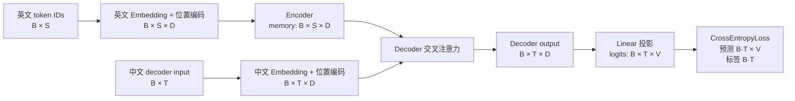

# Transformer 中英翻译结构与 shape

## 记号

- `B`：batch size。
- `S`：英文源序列长度。
- `T`：中文解码器输入长度。
- `D`：模型维度 `d_model`。
- `H`：注意力头数。
- `d_head`：每个头的维度，等于 `D / H`。
- `V`：中文词表大小。

## 从输入到输出的 shape 图

teacher forcing 会把完整中文目标 `[B, T+1]` 错位成解码器输入 `[B, T]` 与监督标签 `[B, T]`。

## 注意力内部 shape

1. 输入投影后的 Q 为 `[B, H, Lq, d_head]`。
2. K、V 为 `[B, H, Lk, d_head]`。
3. `QKᵀ` 得到分数 `[B, H, Lq, Lk]`。
4. softmax 沿 `Lk` 计算，每个查询对所有键位置的权重和为 `1`。
5. 权重乘 V 得到 `[B, H, Lq, d_head]`。
6. 合并多头后回到 `[B, Lq, D]`。

编码器自注意力中 `Lq=Lk=S`，解码器自注意力中 `Lq=Lk=T`，交叉注意力中 `Lq=T`、`Lk=S`。

## 关键模块

### `scaled_dot_product_attention`

计算 `softmax(QKᵀ / √d_head)V`。
缩放可以防止特征维度增大时点积过大，从而减轻 softmax 饱和。
mask 在 softmax 前把不可见位置设为 `-inf`，使相应权重变为 `0`。

### `MultiHeadAttention`

它先把 `D` 拆为 `H × d_head`，让不同头学习不同匹配关系，再合并为原来的 `D`。

### `EncoderLayer`

编码器层由自注意力、残差连接、LayerNorm 和位置前馈网络组成。
Q、K、V 都来自英文侧当前表示。

### `DecoderLayer`

解码器层先执行带 `tgt_mask` 的目标端自注意力，再执行查询英文 `memory` 的交叉注意力，最后执行位置前馈网络。
交叉注意力的 Q 来自中文端，K、V 来自英文编码器 `memory`。

### 两种 mask

- padding mask 遮住 `<PAD>`，防止填充位置参与注意力。
- causal mask 遮住当前位置之后的中文 token，防止训练时偷看未来答案。
- `src_mask` 的典型 shape 为 `[B, 1, 1, S]`，通过广播让所有查询忽略同一批英文 PAD 位置。
- `tgt_mask` 的典型 shape 为 `[B, 1, T, T]`，每个目标位置拥有不同的历史可见范围。

### 训练与推理

训练使用 teacher forcing，解码器输入真实中文前缀，并行预测所有下一个 token。
推理没有真实中文答案，只能从 `BOS` 开始，把自己生成的 token 追加回输入，逐 token 生成到 `EOS` 或最大长度。

## 最近一次实验结果

- 数据量为 10 条训练样本和 2 条验证样本，属于流程验证而不是有效的翻译质量实验。
- 训练 loss 从 `4.8233` 降至 `1.9668`。
- 最佳验证 loss 为 `4.5734`，出现在第 5 个 epoch。
- 第 20 个 epoch 的验证 loss 上升到 `4.7680`，而训练 loss 持续下降，说明小数据集已经过拟合。
- 详细逐 epoch 指标位于 `outputs/validation_results.json`。

## 可复现性

脚本使用固定随机种子 `42`，数据文件保存在仓库中，并使用相对路径读取。
运行 `python transformer_translation.py` 可先验证所有核心模块和 shape，再运行 `python train_transformer.py` 复现实验。
